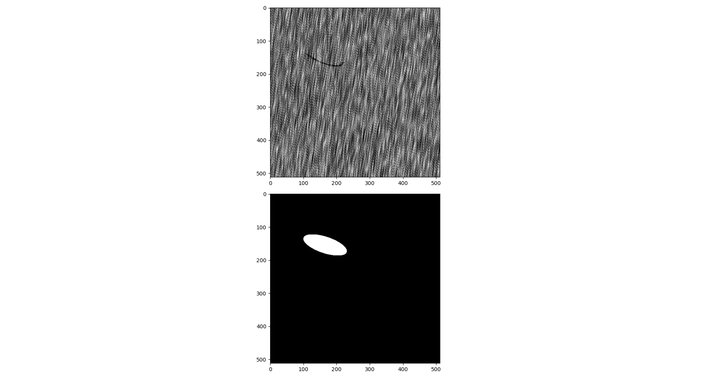

# Defect Classification/Detection
This repo compare methods to defect classificaton and detecton. Reference [2] gives a general introduction for recent methods in this field. The dataset I used is [DAGM 2007](https://conferences.mpi-inf.mpg.de/dagm/2007/prizes.html) . 

## Getting Started

### Prerequisites
* Keras 2.4.3
* Tensorflow 2.2.0
* Opencv for python

### DAGM 2007 Dataset
There are 6 different data sets and each simulated using a different texture and defect model. Each data set has training set which is under Train folder and testing set which is under Test folder.  Below are two sample images. The first image is without defects; the second image contains a scratch-shaped defect which appears as a thin dark line. The defect in the second image is weakly labeled by a surrounding ellipse, shown in the third image. 
 

## Methods
1.Convolutional Neural Network based Classifier

a) [MobileNetV2](https://github.com/cvipdnn/defect_detection/tree/master/cnn/mobilenetv2)

b) [SimpleCNN](https://github.com/cvipdnn/defect_detection/tree/master/cnn/simplecnn) 

2.Semantic Segmenation with Fully Convolutional Neural Network + Classifier 
In reference 4, it first runs semantic segmentation , then it runs a decision network to check if the whole image contains defect or not. In my current implementation, for simplicity, instead of using decision metwork, I am using the number of pixels with defect to classify. 

 
The accuracy for the testing set. 

Method |Accuracy(no defect)  | Accuracy(with defect)  | Multiplication FLOPs(512x512 image) 
--- | --- | --- | ---
1.a) | 100.0% | 99.56%|  28944.9G
1.b)| 100.0% | 0% | 63.2G 
2) | 97.5% | 93.17%  |  63.2G

## Code Location
1. cnn: Convolutional Neural Network based Classifier
2. utils: a tool used to analyze the performance of neural network, like multiplication FLOPs. 

## References
1.https://www.kaggle.com/c/1056lab-defect-detection/data

2.https://github.com/XiaoJiNu/surface-defect-detection

3.https://conferences.mpi-inf.mpg.de/dagm/2007/

4.Segmentation-based deep-learning approach for surface-defect detection

