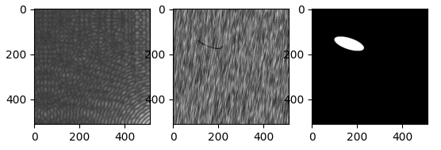

# Defect Classification/Detection
This repo compare methods to defect classificaton and detecton. Reference [2] gives a general introduction for recent methods in this field. The dataset for testing is [DAGM 2007](https://conferences.mpi-inf.mpg.de/dagm/2007/prizes.html) . 

## Getting Started

### Prerequisites
* Keras 2.4.3
* Tensorflow 2.2.0
* Opencv for python

### DAGM 2007 Dataset
There are 6 different data sets and each simulates using a different texture and defect model. Each data set has training set which is under Train folder and testing set which is under Test folder.  Below are two sample images. The first image is without defects; the second image contains a scratch-shaped defect which appears as a thin dark line. The defect in the second image is weakly labeled by a surrounding ellipse, shown in the third image.  All the images are 512x512.
 

## Methods
1.Convolutional Neural Network based Classifier (Using the whole image)

a) [MobileNetV2](https://github.com/cvipdnn/defect_detection/tree/master/cnn/mobilenetv2)

b) [SimpleCNN](https://github.com/cvipdnn/defect_detection/tree/master/cnn/simplecnn) 

b.1) a small cnn network

b.2) a smaller version of CNN based on MobileNetV2 by evaluating different feature outputs( final feature map output from the layer 'block_5_depthwise_relu' in MobileNetV2)

Note that:
1)From the accuracy table below, 1.b.1) is not a good model to solve this problem. 
2) Using the whole image to classify may not be a good idea, especially when the defect size is small. A better idea is to use tile based classifier, which is kind of like 'Semantic Segmentation'.
  

2.[Semantic Segmenation with Fully Convolutional Neural Network + Classifier](https://github.com/cvipdnn/defect_detection/tree/master/fcn)
 
In reference 4, it first runs semantic segmentation , then it runs a decision network to check if the whole image contains defect or not. In my current implementation, for simplicity, instead of using decision metwork, I am using the number of pixels with defect to classify. 

 
### The accuracy of the testing set

Method |Accuracy(no defect)  | Accuracy(with defect)  | FLOPs of multiplication 
--- | --- | --- | ---
1.a) | 100.0% | 99.56%|  28.9G
1.b.1)| 100.0% | 0% | 0.063G
1.b.2)| 99.97% | 96.04% |  9.224G
2.| 98.1% | 97.8% | 0.197G 

### The list of code

1. cnn: Convolutional Neural Network based Classifier
2. fcn: Semantic Segmentation based classifier
3. utils: a tool used to analyze the performance of neural network, like FLOPs of multiplication(Currently I only count the multiplications from Conv2D, SeparableConv2D and Dense layers and will add BatchNornalization later. Also note that default UpSampling2D uses nearest interpolation, which uses none multiplication). 

## References
1.https://www.kaggle.com/c/1056lab-defect-detection/data

2.https://github.com/XiaoJiNu/surface-defect-detection

3.https://conferences.mpi-inf.mpg.de/dagm/2007/

4.Segmentation-based deep-learning approach for surface-defect detection

