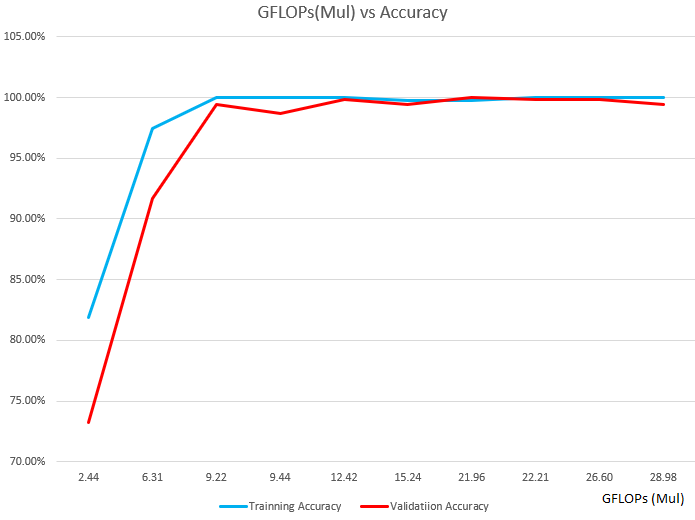

# Different Networks

## 1.Simple CNN 

### Usage  

python train.py
python inference.py

## 2.CNN Search based on MobileNetV2 

Apply feature output from different feature layers in MobileNetV2 and figure out which option can reach accuracy requirement with less computation.  

### Usage

python searchCNN_MobileNet.py

featurelayers=['out_relu', 'block_15_depthwise_relu', 'block_13_depthwise_relu', 'block_13_expand_relu', 'block_10_depthwise_relu', 'block_8_depthwise_relu', 'block_6_depthwise_relu', 'block_5_depthwise_relu', 'block_3_depthwise_relu','block_1_depthwise_relu']

### Result

With block_5_depthwise_relu, we can reach more than 99% validation accuracy and only 9.2GFLops. 

##  3.Random Search CNN

First search how many layers do you need to reach your accuracy goal. Then search each individual layer with random choice and pick up the best one. 

### Usage

python randomNNSearch.py
