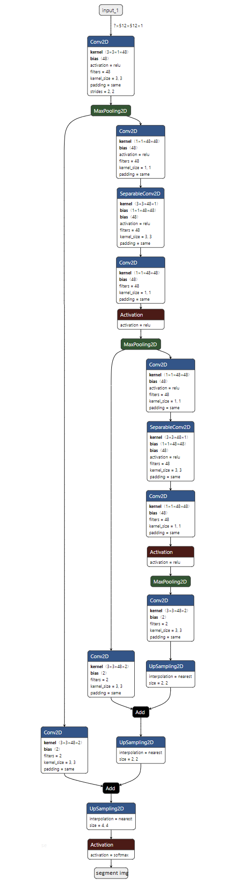

# Semantic Segmenation based Classifier

## Result
The segmenation result from some images without defect
 

The segmenation result from some images with defect (For each image: displaying raw Image->label image for defect->result segmentation image)
 

## Semantic segmentation model

